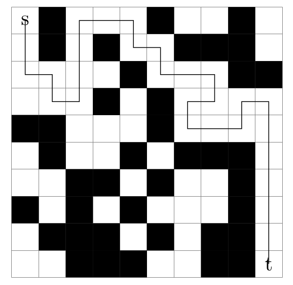

Karlsruhe Longest Paths (KaLP v2.1)
=====
[]([https://opensource.org/licenses/GPL3](https://opensource.org/license/gpl-3-0/))


The KaLP framework -- Karlsruhe Longest Paths -- represents a significant advancement in solving the longest path problem (LP) in undirected graphs. The LP challenge involves identifying the longest simple path between two vertices in a graph, where the path's length is determined by either the number of edges or the total weight of these edges. This problem, recognized for its NP-completeness, finds practical applications in various fields such as circuit board design, project planning, information retrieval, and developing patrolling algorithms for robots in graph environments.

Our contribution lies in proposing an optimal algorithm for the LP problem in undirected graphs [1,2]. This algorithm leverages graph partitioning techniques combined with dynamic programming to enhance computational efficiency. Compared to other existing methods, our approach exhibits significantly higher speed and the ability to solve more complex instances. This performance leap is particularly notable in scenarios involving large and complex graphs, where traditional methods often fall short. Here we provide the implementation of the algorithm as easy to use open source software.

<p align="center">

</p>

[1] Longest Paths Sequentially: https://arxiv.org/pdf/1702.04170.pdf

[2] Longest Paths Parallel: https://arxiv.org/pdf/1905.03645.pdf

[2] Main project site: http://karlsruhelongestpaths.github.io

Installation Notes
=====


## Downloading KaLP: 
You can download KaLP with the following command line:

```console
git clone https://github.com/KarlsruheLongestPaths/KaLP
```

Before you can start you need to install the CMake >= v3.10.

Once you installed the package, just type 
```console
./compile.sh 
```
In this case, all binaries, libraries and headers are in the folder ./deploy/ 

Note that this script detects the amount of available cores on your machine and uses all of them for the compilation process. If you don't want that, set the variable NCORES to the number of cores that you would like to use for compilation. 

Alternatively use the standard cmake build process:
```console 
mkdir build
cd build 
cmake ../ -DCMAKE_BUILD_TYPE=Release     
make 
cd ..
```
In this case, the binaries, libraries and headers are in the folder ./build 

Running Programs
=====

For a description of the graph format (and an extensive description of all other programs) please have a look into the manual. We give a short example here.

#### Example Runs
```console
./deploy/graphchecker ./examples/rgg_n_2_15_s0.graph 
```

```console
./deploy/kalp examples/Grid8x8.graph --start_vertex=0 --target_vertex=63
```
For a description of the graph format please have look into the manual. The graphchecker tool can check the graph format.

License
=====
The program is licenced under GPL 3.0. Please let us know if you need a commercial licence. (We also give away MIT licence on request).
If you publish results using our algorithms, please acknowledge our work by quoting the following paper (PDF):

````
@inproceedings{DBLP:conf/socs/FiegerB0S19,
  author       = {Kai Fieger and
                  Tom{\'{a}}s Balyo and
                  Christian Schulz and
                  Dominik Schreiber},
  title        = {Finding Optimal Longest Paths by Dynamic Programming in Parallel},
  booktitle    = {{SOCS}},
  pages        = {61--69},
  publisher    = {{AAAI} Press},
  year         = {2019}
}
````
